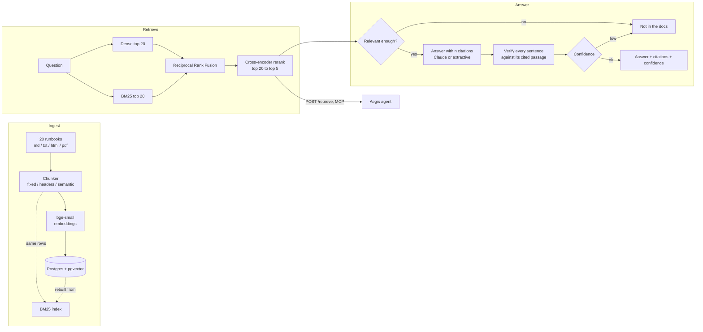

# Athena: Hybrid RAG over DevOps Runbooks

[](https://github.com/Bukola-Baiyewu1/hybrid-rag-runbooks/actions/workflows/ci.yml)


Athena answers on-call questions from a corpus of DevOps runbooks. It searches
with **dense vectors and BM25 at the same time**, fuses the two rankings with
**Reciprocal Rank Fusion**, **reranks** the top candidates with a cross-encoder,
and answers **only from the retrieved passages**. Every sentence of the answer
carries a citation, every citation is **checked against the passage it points
to**, and when the runbooks do not contain the answer Athena says so instead of
guessing.

It ships with an evaluation harness (68 hand-written questions) that produced
every number below, and it serves the [Aegis](https://github.com/Bukola-Baiyewu1/agentic-devops-assistant)
incident agent as an optional retrieval backend over HTTP and MCP.

## Results

Measured in CI on every push with the real models (`bge-small-en-v1.5`
embeddings, `ms-marco-MiniLM-L-6-v2` cross-encoder), header chunking, top 5:

| Retrieval mode | Recall@5 | Hit@1 | MRR | Multi-hop recall | "Not in the docs" gate accuracy |
|---|---|---|---|---|---|
| Dense only (pgvector) | 87.9% | 77.6% | 0.838 | 60.0% | 88.2% |
| BM25 only | 95.7% | 75.9% | 0.853 | 85.0% | 77.9% |
| Hybrid (RRF) | 94.0% | 81.0% | 0.883 | 75.0% | 88.2% |
| **Hybrid + rerank (default)** | **95.7%** | **84.5%** | **0.914** | **85.0%** | **98.5%** |

What the table shows:

* Dense search alone misses exact tokens. Questions about `proxy_read_timeout`,
  `tls-web-previous`, or exit code `137` are where BM25 earns its place.
* Plain RRF fusion is not automatically better than its best input: here it
  loses some recall to BM25 alone, because dense mistakes are fused in. The
  reranker is what turns the fused candidate list into the best ranking:
  +6.9 points Hit@1 over dense, +8.6 over BM25.
* The gate decides when to say "not in the docs". With the reranker's
  probability it declines **all 10 unanswerable questions** and wrongly
  declines **1 of 58** answerable ones. Without a reranker the dense-similarity
  gate lets most unanswerable questions through.

**Chunking strategies** (hybrid + rerank). Recall rewards bigger chunks, so the
context the model must read is reported next to it:

| Strategy | Recall@5 | Hit@1 | MRR | Context per question |
|---|---|---|---|---|
| Fixed 800-char windows | 100.0% | 94.8% | 0.971 | 3,090 chars |
| **Header sections (default)** | 95.7% | 84.5% | 0.914 | **1,145 chars** |
| Semantic (embedding breakpoints) | 94.8% | 84.5% | 0.911 | 1,040 chars |

On these short runbooks an 800-character window covers most of a document, so
fixed chunking wins recall by sending about 2.7 times more text to the model
and citing whole documents instead of sections. Header chunking is the default
because it gives section-precise citations at a third of the context. On longer
documents this comparison should be re-run before choosing.

**Answers, end to end** (headers chunking, 68 questions). The live run uses
Claude (`claude-sonnet-5-5`) to write the answers, to judge whether each cited
passage supports its sentence, and to grade each answer against the golden one:

| Metric | Dense only | **Hybrid + rerank** | Offline baseline (extractive) |
|---|---|---|---|
| Faithfulness (sentences supported by their citation) | 93.9% | **94.2%** | 100% by construction |
| Citation accuracy | 96.0% | **95.6%** | 100% by construction |
| Abstention accuracy (answer vs. "not in the docs") | 91.2% | **95.6%** | 98.5% |
| Correctness vs. golden answers (Claude-graded) | 64.7% | **70.6%** | not measured |

What the live numbers say:

* **Hybrid retrieval with reranking produces better answers**, not just better
  rankings: +5.9 points correctness and +4.4 points abstention accuracy over
  dense-only retrieval, with the same model writing both.
* **About 94% of answer sentences are backed by the passage they cite**, as
  judged independently. The rest are the cases the verifier exists for: they
  lower the answer's confidence, and below 0.5 Athena declines instead.
* **Correctness is the weakest number, and it is graded strictly.** A partly
  complete answer scores 0.5, and declining an answerable question scores 0.
  Abstention drops from 98.5% offline to 95.6% live because the confidence gate
  rejects some Claude answers that the citation judge did not fully support:
  Athena prefers saying "not in the docs" to an unsupported answer.

Run it yourself with `python -m src.eval.run_eval --live --quick` (10 to 20
minutes, a few dollars of API usage). Full tables, including the gate
calibration, are in [docs/EVALUATION.md](docs/EVALUATION.md).

## How it works



1. **Load and chunk.** Each runbook is split three ways. Every chunk keeps its
   file, heading, exact line range, and a checksum, so a citation points at
   precise lines.
2. **Index twice, in sync.** Chunks are embedded into pgvector. Near-duplicates
   (cosine above 0.95) are dropped. The BM25 index is rebuilt from the same
   database rows, so a chunk can never exist in one index and not the other.
3. **Retrieve.** Dense and BM25 search run side by side, RRF merges them by rank
   (not raw score, which is the classic fusion bug), and the cross-encoder
   reads question and passage together to pick the best five.
4. **Gate.** If the best passage's relevance probability is below 0.05, Athena
   declines before generating anything.
5. **Generate.** Claude answers only from the numbered passages, with `[n]`
   after every sentence, and replies `NOT_IN_DOCS` when the passages do not
   answer the question. Passages are wrapped as data, not instructions.
   Without an API key an extractive generator quotes the best sentences instead.
6. **Verify.** Every (sentence, citation) pair is checked: by Claude in live
   mode, by a term-overlap check offline. Uncited sentences and citations to
   passages that do not exist count as unsupported.
7. **Confidence.** Half retrieval relevance, half the share of supported
   sentences. Below 0.5 the answer is withheld and the draft is kept for
   inspection.

## Quickstart

### Option A: Docker (everything in one command)

```bash
git clone https://github.com/Bukola-Baiyewu1/hybrid-rag-runbooks
cd hybrid-rag-runbooks
docker compose up --build
```

Wait for `api` to report healthy (the first build downloads the models into
the image, about 2 minutes). Then:

* Dashboard: http://localhost:8501. Ask "How do I roll back the TLS certificate?"
  and switch between retrieval modes side by side.
* API docs: http://localhost:8000/docs

### Option B: Python on Windows (PowerShell)

```powershell
git clone https://github.com/Bukola-Baiyewu1/hybrid-rag-runbooks
cd hybrid-rag-runbooks
py -3.11 -m venv .venv
.\.venv\Scripts\Activate.ps1
python -m pip install --require-hashes -r requirements.txt
uvicorn src.api.main:app --reload
```

The first start downloads the two models (about 150 MB) and indexes the corpus
in memory. Success looks like `Application startup complete`. In a second
terminal:

```powershell
curl.exe -s -X POST http://127.0.0.1:8000/ask -H "Content-Type: application/json" -d "{\"question\": \"How do I release a stale Terraform state lock?\"}"
```

You get an answer citing `terraform-state-lock.md`, the verification result
for every sentence, and a confidence score. Ask something outside the runbooks
("What is the capital of Finland?") and it declines.

To use Claude for answers and citation checking, copy `.env.example` to `.env`
and set `ANTHROPIC_API_KEY`.

## Evaluation

```bash
python -m src.eval.run_eval            # offline: retrieval matrix, gate calibration, extractive answers
python -m src.eval.run_eval --live     # adds Claude answers, Claude citation judge, graded correctness
```

Results are written to `eval_results/latest.md` and `latest.json`. The golden
set (`src/eval/golden.jsonl`) has 68 hand-written questions: 43 single-section
lookups, 10 multi-hop questions whose answer spans two sections or files, 10
questions the runbooks cannot answer, and 5 deliberately vague ones. Relevance
is judged by evidence (file plus a phrase the supporting text contains), not by
chunk id, so all three chunking strategies are scored fairly.

## API and MCP

| Endpoint | Purpose |
|---|---|
| `POST /ask` | `{"question", "mode"?, "strategy"?}` returns the answer, citations with line ranges, per-sentence verification, confidence |
| `POST /retrieve` | `{"query", "mode"?, "strategy"?, "top_k"?}` returns ranked passages and a `relevant` flag. This is what Aegis calls |
| `POST /ingest` | Re-index the corpus (requires `X-Admin-Token` when `ATHENA_ADMIN_TOKEN` is set) |
| `GET /documents` | Indexed runbooks and chunk counts per strategy |
| `GET /health`, `GET /ready` | Liveness and readiness |

`python -m src.mcp_server` exposes `retrieve` and `ask` as read-only MCP tools
for Claude Code, Claude Desktop, Cursor, or an agent.

## Using Athena as Aegis's retriever

Aegis has a built-in TF-IDF retriever. Set `AEGIS_RETRIEVER=athena` and
`ATHENA_URL=http://localhost:8100` in Aegis to use Athena instead. Chunk ids
and line ranges use the same format, so Aegis's citation policy and approval
page work unchanged. If Athena is unreachable, Aegis falls back to TF-IDF and
counts it in `aegis_retriever_fallbacks_total`.

CI runs Aegis against Athena on every push. On Aegis's own 5 runbooks and 16
labelled queries:

| Metric | Aegis TF-IDF | Athena |
|---|---|---|
| Correct runbook first | 93% | 86% |
| Supporting section in top 3 | 93% | 93% |
| Unrelated queries rejected | 100% | 100% |

On that small corpus Athena ties on recall and loses one query: the
cross-encoder judges "volume almost full, delete old files?" not relevant
enough to answer, while TF-IDF still ranks the disk-pressure runbook first.
Those 16 queries were written together with the TF-IDF retriever, and a better
retriever has to beat it on the measurement, not on paper. So Aegis keeps
TF-IDF as its default, and Athena is the option for a larger, more varied
corpus like the 20-runbook one measured above.

## Configuration

All settings are environment variables; `.env.example` lists the common ones.

| Variable | Default | Purpose |
|---|---|---|
| `DATABASE_URL` | `memory` | `postgresql+psycopg://...` for pgvector |
| `ATHENA_STRATEGY` | `headers` | `fixed`, `headers`, or `semantic` |
| `ATHENA_RERANKER` | `cross-encoder` | `cross-encoder`, `claude`, or `none` |
| `ATHENA_TOP_K` | `5` | Passages returned |
| `ATHENA_MIN_RELEVANCE` | `0.05` | Reranker probability needed to answer |
| `ATHENA_MIN_CONFIDENCE` | `0.5` | Confidence needed to show the answer |
| `ANTHROPIC_API_KEY` | empty | Enables Claude answers and the Claude citation judge |
| `ATHENA_GENERATION_MODEL` | `claude-sonnet-5-5` | Model for answers |
| `ATHENA_ADMIN_TOKEN` | empty | Protects `POST /ingest` |

## Development

```bash
pip install --require-hashes -r requirements.txt -r requirements-dev.txt
pytest -q --cov                 # 84 tests; set ATHENA_TEST_DATABASE_URL to run them on pgvector
ruff check src scripts tests dashboard && mypy
```

Tests run offline with a hashing embedder and a lexical reranker, so they need
no downloads and no API key. The real models are exercised by the CI
evaluation job. CI also runs the suite on PostgreSQL + pgvector, audits the
locked dependencies, scans the git history for secrets, builds the containers,
runs a smoke test against the Compose stack, and runs Aegis against Athena.

```
src/
  ingest/      loaders.py, chunking.py (3 strategies), index.py (embed, dedup, store)
  retrieve/    sparse.py (BM25), fusion.py (RRF), rerank.py, pipeline.py
  generate/    answer.py, verify.py (citation checking), confidence.py
  eval/        golden.jsonl, metrics.py, run_eval.py
  api/main.py  HTTP API          mcp_server.py   MCP tools
  athena.py    the ask() pipeline  store.py  pgvector / in-memory  embed.py  embeddings
dashboard/     Streamlit app
corpus/        20 runbooks
```

## Honest boundaries

* **Corpus size.** Built and evaluated on 20 runbooks. Search is an exact scan
  in pgvector, which is right at this size; add an HNSW index for thousands of
  documents.
* **Golden set.** 68 questions written for this corpus. The relevance threshold
  was calibrated on the same set, so the gate accuracy is optimistic.
* **Offline answers.** Without an API key, answers are extracted sentences and
  citations are checked by word overlap. The generation metrics that matter
  come from the `--live` run.
* **Models.** `bge-small` and MiniLM are small, free, and run on a CPU. Larger
  embedding or reranking models may raise recall at higher cost; the evaluation
  harness is how to decide.

More detail: [docs/ARCHITECTURE.md](docs/ARCHITECTURE.md), [docs/EVALUATION.md](docs/EVALUATION.md).

## License

MIT
